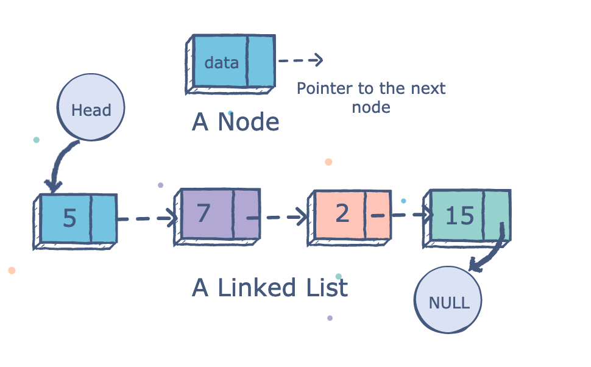

# Introdução à Linguagem

## Tipos

Em java existem 8 tipos primitivos:

- Inteiros

  - byte: $[-2^7, 2^{7-1}]$
  - short: $[-2^15, 2^{15-1}]$
  - int: $[-2^31, 2^{31-1}]$
  - long: $[-2^63, 2^{63-1}]$

- Reais

  - float: 32-bit IEEE 754
  - double: 64-bit IEEE 754

- Outros

  - char: 'a'
  - boolean: true or false

## IO

- Input:

  - `System.out.println();` ou
  - `System.out.print();` ou
  - `System.out.printf();`

- Output:

  ```java
        Scanner input = new Scanner(System.in);
        int number = input.nextInt();
  ```

## Output - Exemplo

```java
class HelloWorld {
    public static void main(String[] args) {
        System.out.println("Hello, World!");
    }
}
```

## Input - Exemplo

```java
import java.util.Scanner;

class Input {
    public static void main(String[] args) {
        Scanner input = new Scanner(System.in);

        System.out.print("Enter an integer: ");
        int number = input.nextInt();
        System.out.println("You entered " + number);

        input.close();
    }
}
```

## Classes

Em java tudo é associado com **classes** e **objectos**, juntamente com
os seus atributos e métodos.

Usando uma analogia de um carro:

- **Objecto**: carro
- **Atributos**: peso, potência, ...
- **Métodos**: acelerar, travar (funcionalidade do carro)
- **Classe**: construtor do objecto (blueprint)

Uma **classe** é uma *blueprint* para um objecto.

## Classes - Exemplo

```java
public class Carro {
    int peso;
    string cor;
    int potencia;
    int velocidade;

    void acelerar(int v){
        velocidade+=v;
    }

    private void travar(){
        velocidade-=v;
    }
}
```

## Construtores

Um **Construtor** é um **método** especial, que é usado para inicializar
o objecto.

```java
public class Carro {
    int peso;
    String cor;
    int potencia;
    int velocidade;
    ...
    public Carro(int peso, int potencia,
                int velocidade, String cor){
        this.peso = peso;
        this.potencia = potencia;
        this.velocidade= potencia;
        this.cor= cor;
    }
}
```

## Uso no código

```java
...
main() {
...
    Carro xpto = new Carro(2500,170,0,"Azul");

    xpto.acelerar(100);
...
```

## Overloading

Overloading consiste em declaramos vários métodos com o mesmo nome, em
que a diferença entre estes métodos consiste nos seus
parâmetros(argumentos) e/ou tipo de retorno.

O Java é inteligente o suficiente para invocar correctamente o método
que foi declarado com inteiro como parâmetro.

## Overloading - Exemplo

```java
// Método
 acelerar(int v){
        velocidade+=v;
 }

 acelerar(float v){
        velocidade+=v;
 }
 ...
// Construtor
 public Carro(int peso, int potencia,
              int velocidade, string cor){...}
 public Carro(int peso, int potencia,
              int velocidade){...}

```

## Private vs Public vs ...

Para qualificar uma variável ou método usa se os seguintes "campos":

|           | Class | Package | World |
| --------- | ----- | ------- | ----- |
| public    | +     | +       | +     |
| protected | +     | +       |       |
| default   | +     | +       |       |
| private   | +     |         |       |

\+ -> estar acessível

## Herança

Em Java, a herança é um conceito que permite criar novas classes com
base em classes existentes. Podemos pegar numa classe que já existe e
herdar todos os métodos/atributos dela para a nova classe.

## Herança - Exemplo Carro

```java
public autocarro extends carro {
    String rota;
    String operadora;

    public autocarro(int p, int pot, int vel,
                    String cor, String rota,
                    String operadora){
        super(p,pot,vel,cor);
        this.rota = rota;
        this.operadora = operadora;
    }
}
```

## Tipos Genéricos

Por vezes precisamos de algo que funcione com qualquer tipo de dados.

```java
public class Par(){
    private A first;
    private B second;
    Par(A a, B b){
        this.first = a; this.second = b;
    }
}
public class Main(){
    public static void main(){
        Pair <String , String > p1 =
            new Pair <String ,String >("A","B");
        Pair <String , Integer > p3 =
            new Pair <String ,Integer >("Dois" ,2);
    }
}
```

## Tipo Abstracto de Dados

Consiste num "modelo" de tipo de dados onde é definido o comportamento
esperado:

- Quais valores pode conter;
- Quais operações existem sobre este tipo

Diz-se abstracto porque a sua definição não carece de uma implementação
concreta

[Implementações](https://docs.oracle.com/javase/tutorial/collections/implementations/index.html)

```java
...
Set conjunto = new HashSet<Integer>();
...
```

# Estrutura de Dados

## Listas Ligadas

Uma lista ligada, ou "linked list" em inglês, é uma estrutura de dados
fundamental na programação que consiste em uma sequência de elementos,
onde cada elemento é chamado de "nó" (ou "node"). Cada nó contém dois
campos principais:

- Dado: Armazena o valor ou informação que você deseja armazenar na
  lista.
- Ponteiro: Armazena a referência ao próximo nó na
  sequência, indicando qual é o nó seguinte na lista.

{height=50%}

## Pilhas

Segue o princípio do último a entrar, primeiro a sair (LIFO, do inglês
Last-In-First-Out).

É como uma pilha de pratos, onde adicionamos(**push**) e
removemos(**pop**) pratos do topo da pilha, e o último prato colocado é
o primeiro a ser retirado.

{height=50%}

## Filas

Segue o princípio do primeiro a entrar, primeiro a sair (FIFO, do inglês
First-In-First-Out). É como uma fila de pessoas num banco, onde a
primeira pessoa na fila é a primeira a ser atendida.

Em uma fila, as operações principais incluem:

- Enqueue: Adicionar um elemento (ou item) no final da fila.
- Dequeue: Remover o elemento no início da fila.

{height=50%}

# Mãos à obra

## Exercícios

1. Implementar uma lista ligada de raiz.
1. Modificar a lista anterior para ser duplamente ligada.
1. Modificar a lista anterior para ser circular.
1. Implementar uma pilha.
1. Implementar uma fila.
